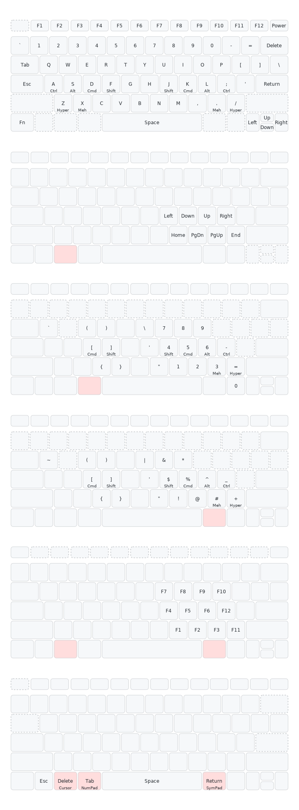

# Karabiner CAGS - Apple Magic Keyboard

Karabiner-Elements complex modification configs for the Apple Magic Keyboard: 
- home row mods (CAGS)
- Hyper and Meh keys
- cursor, number pad, symbol pad and function pad layers

This aligns the Apple Magic Keyboard with my Corne ZMK keymap by remapping the bottom row to behave like ZMK layer-tap (LT) keys. Keys assigned to the thumb cluster in the Corne layout (e.g., Tab, Delete, Return) are disabled on their original positions and accessed via layers, matching the thumb-centric, layer-driven design typical of ZMK keymaps. All physical modifier keys are disabled and reimplemented as home row mods (HRMs), mirroring the mod-tap-based modifier behavior used in ZMK.

**Combined config:** [karabiner-cags.json](out/karabiner-cags.json)

**Build:**
```bash
./build.sh
```

**Build and install** (copy to `~/.config/karabiner/assets/complex_modifications/`):
```bash
./build.sh --install
```
Then enable the rule in Karabiner-Elements -> Preferences -> Complex Modifications -> Add rule.

For full project details, file structure, and conventions, see [CLAUDE.md](CLAUDE.md).


